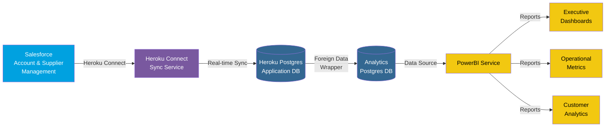

```mermaid
flowchart LR
    SF[Salesforce<br>Account & Supplier<br>Management] -->|Heroku Connect| HC[Heroku Connect<br>Sync Service]
    HC -->|Real-time Sync| PG[(Heroku Postgres<br>Application DB)]
    PG -->|Foreign Data<br>Wrapper| APG[(Analytics<br>Postgres DB)]
    APG -->|Data Source| PBI[PowerBI Service]
    PBI -->|Reports| R1[Executive<br>Dashboards]
    PBI -->|Reports| R2[Operational<br>Metrics]
    PBI -->|Reports| R3[Customer<br>Analytics]

    style SF fill:#00a1e0,color:#fff
    style HC fill:#79589f,color:#fff
    style PG fill:#336791,color:#fff
    style APG fill:#336791,color:#fff
    style PBI fill:#f2c811,color:#000
    style R1 fill:#f2c811,color:#000
    style R2 fill:#f2c811,color:#000
    style R3 fill:#f2c811,color:#000
```
