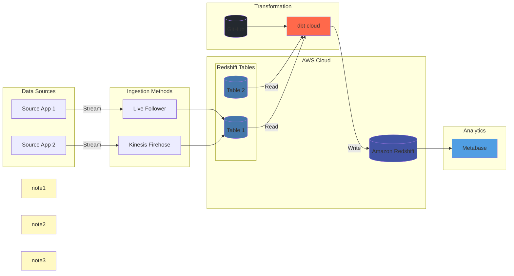

```mermaid
flowchart LR
    subgraph "Data Sources"
        SRC1[Source App 1]
        SRC2[Source App 2]
    end

    subgraph "Ingestion Methods"
        LF[Live Follower]
        KF[Kinesis Firehose]
    end

    subgraph "AWS Cloud"
        subgraph "Redshift Tables"
            T1[(Table 1)]
            T2[(Table 2)]
        end

        RS[(Amazon Redshift)]
    end

    subgraph "Transformation"
        GH[(GitHub)]
        DBT[dbt cloud]
    end

    subgraph "Analytics"
        direction TB
        MB[Metabase]
    end

    SRC1 -->|Stream| LF
    SRC2 -->|Stream| KF
    LF & KF --> T1
    T2 -->|Read| DBT
    T1 -->|Read| DBT
    GH --> DBT
    DBT -->|Write| RS
    RS --> MB

    style T1 fill:#4477AA
    style T2 fill:#4477AA
    style RS fill:#4153A4
    style GH fill:#24292F
    style DBT fill:#FF694B
    style MB fill:#509EE3
    style note1 fill:#fff9c4
    style note2 fill:#fff9c4
    style note3 fill:#fff9c4
```
