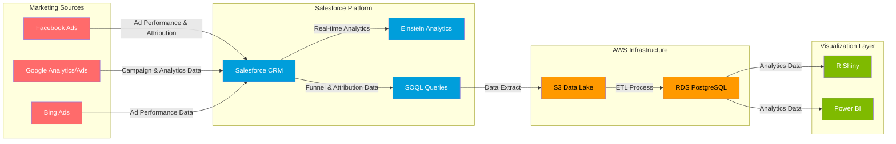

```mermaid
flowchart LR
subgraph Marketing [Marketing Sources]
FB[Facebook Ads]
GA[Google Analytics/Ads]
BA[Bing Ads]
end

subgraph Salesforce [Salesforce Platform]
SF[Salesforce CRM]
EA[Einstein Analytics]
SOQL[SOQL Queries]
end

subgraph AWS [AWS Infrastructure]
S3[S3 Data Lake]
RDS[RDS PostgreSQL]
end

subgraph Visualization [Visualization Layer]
RS[R Shiny]
PBI[Power BI]
end

%% Marketing to Salesforce Connections
FB -->|Ad Performance & Attribution| SF
GA -->|Campaign & Analytics Data| SF
BA -->|Ad Performance Data| SF

%% Rest of the data flow
SF -->|Funnel & Attribution Data| SOQL
SOQL -->|Data Extract| S3
SF -->|Real-time Analytics| EA
S3 -->|ETL Process| RDS
RDS -->|Analytics Data| RS
RDS -->|Analytics Data| PBI

%% Styling
classDef sfStyle fill:#009EDB,color:white
classDef awsStyle fill:#FF9900,color:black
classDef vizStyle fill:#7FBA00,color:white
classDef marketingStyle fill:#FF6B6B,color:white

class SF,EA,SOQL sfStyle
class S3,RDS awsStyle
class RS,PBI vizStyle
class FB,GA,BA marketingStyle
```
