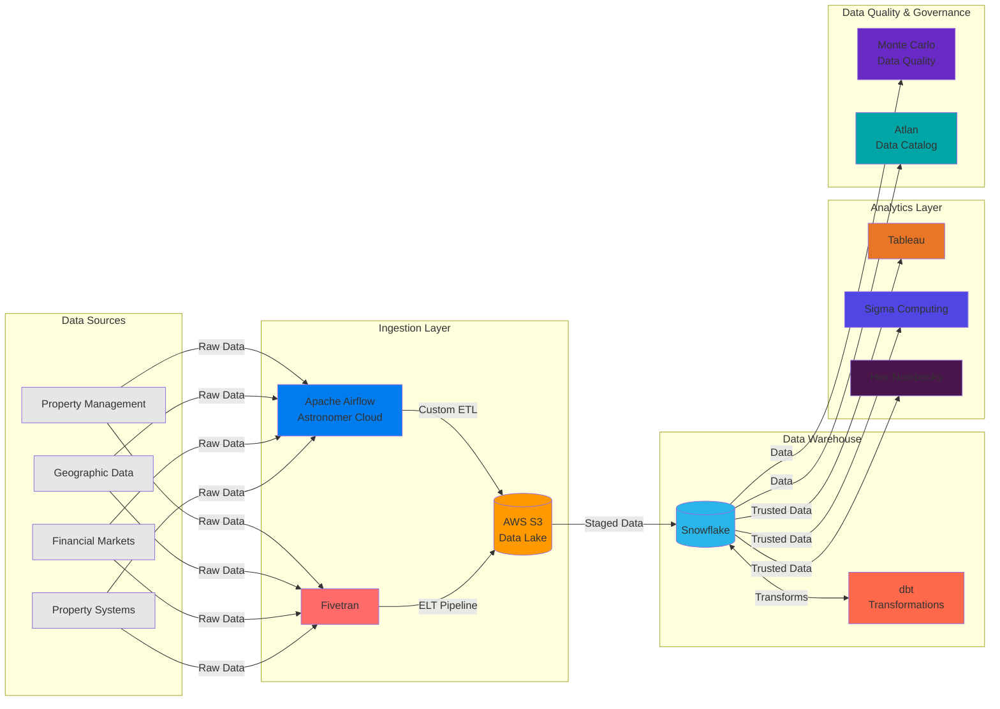

```mermaid
flowchart LR
    subgraph "Data Sources"
        PS[Property Systems]
        FM[Financial Markets]
        GD[Geographic Data]
        PM[Property Management]
    end

    subgraph "Ingestion Layer"
        FT[Fivetran]
        AF[Apache Airflow<br>Astronomer Cloud]
        S3[(AWS S3<br>Data Lake)]
    end

    subgraph "Data Warehouse"
        SF[(Snowflake)]
        DBT[dbt<br>Transformations]
    end

    subgraph "Analytics Layer"
        TB[Tableau]
        SG[Sigma Computing]
        HX[Hex Notebooks]
    end

    subgraph "Data Quality & Governance"
        MC[Monte Carlo<br>Data Quality]
        AT[Atlan<br>Data Catalog]
    end

    PS & FM & GD & PM -->|Raw Data| FT
    PS & FM & GD & PM -->|Raw Data| AF
    FT -->|ELT Pipeline| S3
    AF -->|Custom ETL| S3
    S3 -->|Staged Data| SF
    SF <-->|Transforms| DBT
    SF -->|Data| MC & AT
    SF -->|Trusted Data| TB & SG & HX

    style PS fill:#e6e6e6
    style FM fill:#e6e6e6
    style GD fill:#e6e6e6
    style PM fill:#e6e6e6
    style FT fill:#ff6b6b
    style S3 fill:#FF9900
    style AF fill:#017cee
    style SF fill:#29b5e8
    style DBT fill:#ff694b
    style MC fill:#6929c4
    style AT fill:#00a6a6
    style TB fill:#e97627
    style SG fill:#5046e4
    style HX fill:#4a154b
```
